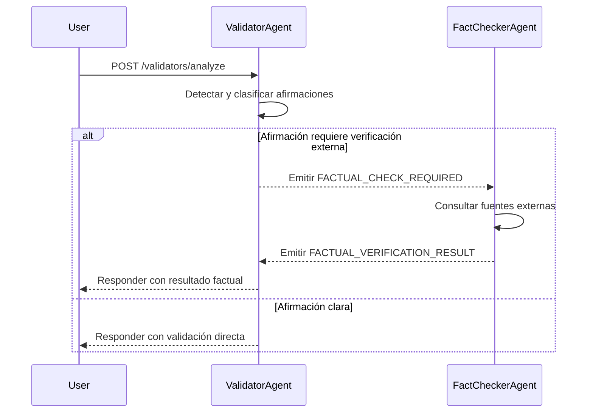

# 🔄 Flujo Validator → FactChecker

Este documento describe el flujo completo que ocurre cuando una afirmación es analizada por el ValidatorAgent y, si es necesario, verificada por el FactCheckerAgent mediante fuentes externas.

## 🧠 Visión general del flujo

Cuando un usuario envía un texto, el sistema analiza si contiene afirmaciones verificables. El flujo sigue una lógica progresiva e inteligente que evita redundancias y optimiza recursos:

1. **Extracción de afirmaciones**:
   El `ValidatorAgent` detecta afirmaciones explícitas dentro del texto y genera un array de afirmaciones normalizadas.

2. **Evitar duplicados**:
   Para cada afirmación, se calcula su embedding semántico. Si ya existe un `Finding` similar y **resuelto** en base de datos, se reutiliza directamente y se relaciona con un nuevo `Finding`, sin necesidad de nuevos análisis.

3. **Evaluación local**:
   Si no hay coincidencias previas, se guarda un nuevo `Finding` y el `ValidatorAgent` intenta generar internamente un `Fact` con base en su conocimiento.

4. **Verificación externa si es necesario**:
   Si el `ValidatorAgent` no puede emitir un veredicto, se publica un evento `FACTUAL_CHECK_REQUIRED`. Este evento activa al `FactCheckerAgent`, quien consulta fuentes externas (Brave, Google, NewsAPI) y genera un razonamiento final junto con un `Fact` definitivo.

5. **Respuesta al usuario**:

    - Si se especificó `waitForFact: true`, el sistema espera el veredicto completo antes de responder.
    - Si `false`, el usuario recibe una respuesta parcial y puede consultar el resultado completo más adelante.

> Este flujo garantiza eficiencia, trazabilidad y máxima reutilización de conocimiento previamente generado.

## 🧠 Paso 1 – Análisis inicial (ValidatorAgent)

1. El usuario envía un texto al endpoint `POST /validators/analyze`.
2. `ValidatorAgent` detecta afirmaciones factuales en el texto y determina si alguna necesita verificación externa.
3. Si encuentra una afirmación dudosa, emite un evento `FACTUAL_CHECK_REQUIRED` con los detalles del hallazgo.

## 🌐 Paso 2 – Verificación factual (FactCheckerAgent)

1. `FactCheckerAgent` escucha el evento `FACTUAL_CHECK_REQUIRED`.
2. Ejecuta búsquedas en Brave, Google CSE y NewsAPI.
3. Utiliza GPT‑4o para sintetizar la información obtenida y generar una respuesta factual.
4. Emite el evento `FACTUAL_VERIFICATION_RESULT` con:

    - Estado (`true`, `false`, `possibly_true`, `unknown`)
    - Fuentes consultadas y utilizadas
    - Timestamp de verificación

## 🔁 Paso 3 – Respuesta final

- Si la solicitud original tenía `waitForFact: true`, el ValidatorAgent espera el resultado del FactCheckerAgent antes de devolver la respuesta final.
- Si no, la verificación ocurre en segundo plano y se puede consultar luego desde `/facts/verifications/last` o `/facts/verifications/:id`.

## 🧾 Resumen del flujo de eventos

> 📌 Este diseño basado en eventos desacopla los agentes, mejora la escalabilidad y permite trazabilidad completa de cada paso del proceso.
